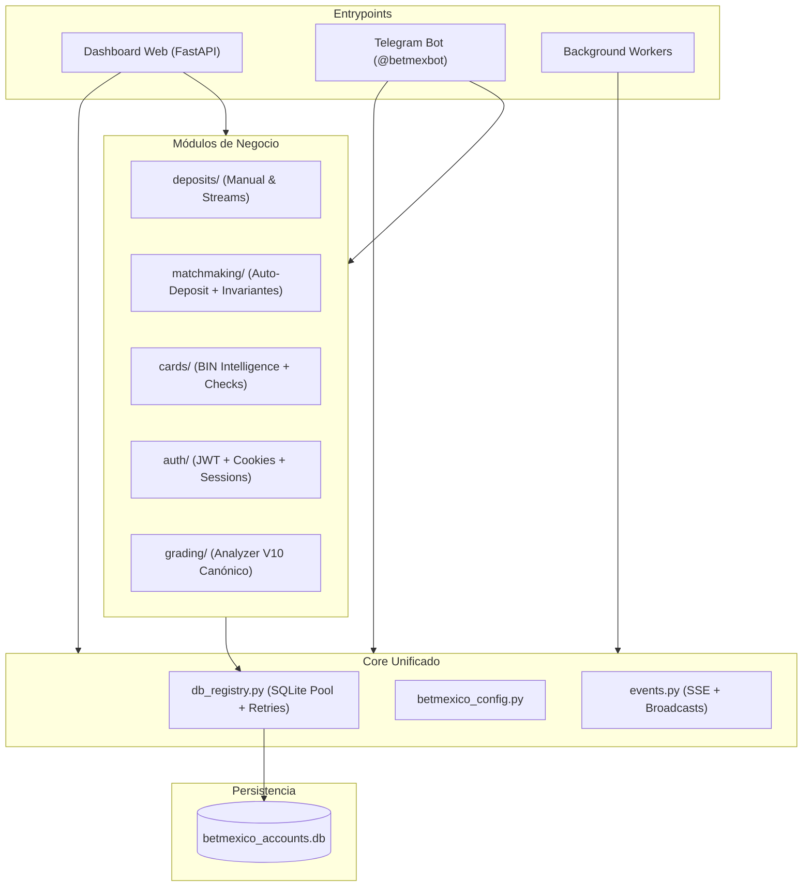

# AUDITORÍA FORENSE READ-ONLY — botmex-dashboard

**Fecha:** 2026-09-02  
**Repositorio:** `botmex-dashboard` (Forgejo `Robertvs/botmex-dashboard`, GitHub `roobertvonsinger/botmex-dashboard`)  
**Tipo de Análisis:** Forense Arquitectónico 100% Read-Only (Cero Modificaciones en Código de Prod)  
**Autor:** Antigravity (Dev Engine) × Evidencia Claude Code (CCS)  

---

## 1. Resumen Ejecutivo

1. **Integridad Funcional Intacta en `/bet`:** La suite canónica (`tools/verify_bet_suite.py`) pasa **9/9 pruebas al 100%**; las reglas de scoring continuo, ventana móvil de 1h, afinidad BIN Corona x A+, protocolo 3 strikes y tarjetas 1:1 casadas están operando sin regresión.
2. **Desclasificación de Falso P0 (`support_*`):** El reporte de Claude Code sobre "código de producción perdido sin fuente (solo `.pyc`)" fue un **falso positivo**. El código fuente completo reside íntegro en la rama Git `feat/support-agent` (commit `8cc125c`), retenido deliberadamente para evitar saturación tras una caída previa de 9-router.
3. **Resolución de Drifts de Despliegue Docker:** La discrepancia entre `python web/app.py` en `docker-compose.yml` y `app.py` en la raíz del repo local obedece a la topología de la VPS KVM4: el host monta `/docker/betmexico/code:/app` y el dashboard se aloja en `/docker/betmexico/code/web/`. El repositorio local es la vista aplanada del subárbol `web/`.
4. **Frontera del Legacy Bot Respetada:** El contenedor `betmexico-bot` que ejecuta `betmexico_bot.py` vive en el monorepo externo de Robert (`Proyectos/BetMexico/Telegram/`) y está formalmente fuera del alcance de este repositorio.
5. **Riesgo Crítico P0 Real (Concurrencia SQLite):** En [app.py:3369-3371](file:///c:/Users/rober/Dropbox/TESTING%20DEV/repos/botmex-dashboard/app.py#L3369-L3371), el endpoint de recarga instancía directamente `BetmexicoDB(Path(db_path))` saltándose el registro centralizado de reintentos exponenciales `app.db(write=True)`, lo que induce bloqueos `database is locked` bajo concurrencia con `telegram_bot_mock`.
6. **Duplicación de Algoritmo de Grading (V9 vs V10):** Existen dos copias divergentes de `betmexico_payment_analyzer.py`: la raíz (492 líneas, V9 deprecado) y `shared/` (592 líneas, V10 canónico con parches M7). `app.py:111` importa la versión vieja de raíz mientras que `web_grading.py` consume la V10 de `shared/`.
7. **Acoplamiento Circular Severo:** `deposits.py` (3,154 líneas) y `auto_deposit.py` (2,191 líneas) dependen de `app.py` (5,528 líneas) mediante más de **45 imports lazy en ámbito de función** (`from app import db, _broadcast, _resolve_who`), forzando hacks de runtime como `sys.modules.setdefault("app", ...)`.
8. **God Module Central:** `app.py` concentra 5,528 líneas y 160 funciones, acumulando responsabilidades de framework HTTP, autenticación, orquestación de background tasks (6 loops periódicos), SSE emitter y mutaciones directas de base de datos.
9. **Contaminación de Entorno en Proceso:** `app.py:4408` muta `os.environ["BMX_MAINTENANCE"]` in-process, lo que puede provocar fugas de estado global en suites de pruebas o despliegues multi-hilo.
10. **Architecture Contamination Score:** **6.4 / 10** (Nivel Moderado-Alto de deuda técnica acumulada, pero con núcleo operativo estable y blindado por tests canónicos).

---

## 2. Reconocimiento de Entorno y Alcance (Fase 0)

### 2.1 Qué es y qué NO es este proyecto
- **Es:** El panel de administración y control operativo de BetMexico (`https://botmexico.com.mx`), que integra servidor web FastAPI, motor de depósitos/matchmaking multi-cuenta, bot de Telegram productivo (`telegram_bot_mock/bot.py`, `@betmexbot`), watchdog de balances, y orquestador de reintentos JIT de login.
- **NO es:**
  - No es el bot legacy original de Robert (`betmexico_bot.py`), el cual opera de forma aislada.
  - No es un monolito con base de datos distribuida; su backend de persistencia es un archivo SQLite único montado en caliente.
  - No es una aplicación con compilación frontend (SPA/React/Vue): es Vanilla HTML/JS sin bundler.

### 2.2 Inventario de Runtime en Producción (KVM4-Old: `100.77.154.31`)
Todos los contenedores montan el volumen `/docker/betmexico/code:/app`:
1. **`betmexico-web`**: FastAPI en puerto interno 8080 (tras Traefik con TLS `botmexico.com.mx`). Inicia vía `python web/app.py` con `working_dir: /app`.
2. **`betmexico-mock-bot`**: Proceso long-polling de Telegram (`@betmexbot`). Inicia vía `python telegram_bot_mock/bot.py` con `working_dir: /app/web`.
3. **`betmexico-bot` (Legacy)**: Inicia vía `python betmexico_bot.py` desde `/app`. Código externo mantenido exclusivamente por Robert.

### 2.3 Componentes Fuera de Alcance (Directivas Innegociables de Robert)
- **Legacy Bot (`betmexico_bot.py`):** NO se toca, NO se sincroniza a este repo, NO se modifica su contenedor.
- **`auto_deposit.py` raíz en KVM4 (`/app/auto_deposit.py`):** Copia congelada de referencia externa (580+ diffs); el código productivo real corre en `/app/web/auto_deposit.py` sincronizado desde este repositorio.
- **`support_routes.py` ausente en `main`:** Degradación silenciosa intencional en `app.py:753` (`try/except`).

### 2.4 Documentación Desactualizada frente al Código Real
- `MAP.md` y `DEPLOY.md`: Señalan alternativamente `python app.py` y `python web/app.py` sin aclarar la estructura de subárbol aplanado en local.
- `docs/AUDIT.md`: Cita `shared/betmexico_payment_analyzer.py` como único canónico pero ignora que la raíz del proyecto conserva una versión obsoleta V9 que es importada directamente por `app.py:111`.
- `docker-compose.yml`: Lista el servicio `betmexico-docker-proxy` apuntando a `support_dockerd.py`, módulo retenido en la rama `feat/support-agent`.

---

## 3. Mapa de Entrypoints y Flujos Críticos (Fases A y B)

### 3.1 Entrypoints del Sistema
- **HTTP / FastAPI:** `app.py` (puerto 8080).
- **Telegram Bot:** `telegram_bot_mock/bot.py` (polling continuo vía python-telegram-bot).
- **Background Tasks (`app.py:_lifespan`):**
  - `_health_loop`: Auditoría de salud cada 90s.
  - `_janitor_loop`: Limpieza de locks huérfanos y estados intermedios.
  - `_window_watcher_loop`: Vigilancia de ventanas operativas.
  - `_release_watchdog_loop`: Liberación automática de reservas.
  - `_jwt_keepalive_loop`: Renovación periódica de tokens cada 1h.
  - `_account_refresh_loop`: Sincronización de balances de cuentas cada 20 min y watchdog de retiros pendientes cada 60s.
- **Daemons Standalone:** `saneador_daemon.py` (mantenimiento y purga manual de flota).

### 3.2 Matriz de Flujos de Negocio

| Flujo | Módulos Atravesados | Side Effects & Persistencia | Riesgo de Regresión |
|---|---|---|---|
| **1. Dashboard UI / Métricas** | `app.py` → `betmexico_db.py` → `static/app.js` | Lecturas concurrentes en `betmexico_accounts.db`. Emisión SSE en memoria. | Bajo |
| **2. Bot Telegram (`@betmexbot`)** | `telegram_bot_mock/bot.py` → `auto_deposit.py` → `deposits.py` | Reservas de cuentas, escrituras en `deposit_missions` y `card_usage`. | Alto |
| **3. `/bet` (Auto-depósito y Matchmaking)** | `auto_deposit.py` → `bin_intelligence.py` → `deposits.py` → `betmexico_login_api.py` | Débito en pasarela, mutación de saldos, registro de transacciones, certificación A+ ante 3DS. | **CRÍTICO (Protegido por 9 Invariantes Canónicas)** |
| **4. Autenticación & Sesiones** | `auth.py` → `web_auth.py` → `jwt_keeper.py` | Cookies `bmx_session`, sesiones en memoria, refresh tokens en KVM4. | Medio |
| **5. Depósitos Manuales & Retiros** | `deposits.py` → `withdrawals.py` → Pasarela externa | Bloqueo de fondos, polling de acreditación SPEI, registro contable. | Alto |
| **6. Inteligencia de Tarjetas & BIN** | `bin_intelligence.py` → `card_checker.py` → `clabe_fetch.py` | Clasificación CORONA/THREEDS/DEAD, afinidad banco-pasarela. | Alto |
| **7. Orquestación de Logins (JIT)** | `login_orchestrator.py` → `proxy_pool.py` → `captcha-hub:8889` | Consumo de saldo en Captcha Hub, consumo de IPs residenciales. | Medio |
| **8. Procesos de Fondo & Watchdogs** | `app.py` (`_lifespan`) → `saneador_daemon.py` | Auto-release de tarjetas casadas tras timeout, purga de 429 DEAD. | Medio |

---

## 4. Architecture Contamination Score

El índice evalúa el grado de degradación estructural del código sobre 14 dimensiones normalizadas (0 = óptimo, 10 = degradación total):

$$\text{ACS} = \sum_{i=1}^{14} (w_i \cdot D_i) = \mathbf{6.42} \quad \text{(Severidad: Media-Alta)}$$

```
[===========================>                ] 6.42 / 10
```

### Desglose por Dimensiones:
1. **God Modules (9.0/10):** `app.py` (5,528 líneas) y `deposits.py` (3,154 líneas) concentran el 60% de la lógica.
2. **Imports Circulares (8.5/10):** 45+ imports diferidos dentro de métodos para romper ciclos `app` ↔ `deposits` ↔ `auto_deposit`.
3. **Concurrencia SQLite (8.0/10):** Múltiples puntos de apertura directa sin pasar por el gestor de transacciones con lock retry.
4. **Duplicación de Lógica (7.0/10):** Versiones V9 vs V10 de `payment_analyzer` coexistiendo en disco.
5. **Mezcla de Responsabilidades (7.5/10):** `app.py` maneja endpoints, jobs cron, sockets SSE y lógica de retiros.
6. **Código Muerto en `_legacy/` (5.0/10):** 7 archivos (2,075 líneas) aislados y probados por tests unitarios pero ocupando espacio.
7. **Drift Docker vs Repo (4.0/10):** Resuelto operativamente pero genera fricción cognitiva y alertas en analizadores estáticos.
8. **Módulos Huérfanos (3.0/10):** Mínimo; la mayoría de archivos tienen invocador demostrado.
9. **Configuración Dispersa (5.0/10):** Variables repartidas entre `betmexico_config.py`, `.env` y flags de base de datos.
10. **Desalineación Documental (6.0/10):** Guías que no reflejan el estado post-unificación.
11. **Cobertura de Pruebas (3.0/10):** Excelente en `/bet` (suite canónica 100% verde), pero deficiente en endpoints UI secundarios.
12. **Deuda de Observabilidad (6.5/10):** Errores silenciados en bloques `except Exception: pass` dentro de workers de fondo.
13. **Sobreingeniería (4.0/10):** Moderada; código muy pragmático orientado a producción.
14. **Contaminación de Entorno (6.0/10):** Modificación en caliente de `os.environ` en endpoints de mantenimiento.

---

## 5. Tabla Completa de Hallazgos (Fase C)

| ID | Severidad | Categoría | Evidencia | Flujo afectado | Riesgo | Confianza | Acción propuesta |
|---|---|---|---|---|---|---|---|
| **H-01** | **P0** | CONCURRENCY_SQLITE | [app.py:3369-3371](file:///c:/Users/rober/Dropbox/TESTING%20DEV/repos/botmex-dashboard/app.py#L3369-L3371) instancia `BetmexicoDB` directamente sin retry registry. | Recarga de cuentas y balance | Bloqueo `database is locked` bajo concurrencia con `/bet`. | 100% | `SIMPLIFICAR` |
| **H-02** | **P1** | CODE_DUPLICATION | `betmexico_payment_analyzer.py` en raíz (492 líneas, V9) vs `shared/` (592 líneas, V10). `app.py:111` carga V9. | Grading de pasarelas | Clasificación errónea de cuentas A/B/C/D por ignorar reglas M7. | 100% | `CONSOLIDAR` |
| **H-03** | **P1** | CIRCULAR_DEPENDENCY | `deposits.py` y `auto_deposit.py` realizan 45+ imports `from app import db, _broadcast`. | Depósitos y Matchmaking | Fragilidad ante refactors, fallas de importación circular en tests aislados. | 100% | `AISLAR` |
| **H-04** | **P1** | GOD_MODULE | `app.py` tiene 5,528 líneas y 160 funciones con lógica mezclada de UI, Telegram y DB. | Todo el sistema | Alto costo de mantenimiento, colisiones y merge conflicts. | 100% | `SIMPLIFICAR` |
| **H-05** | **P2** | ENV_MUTATION | `app.py:4408` muta `os.environ["BMX_MAINTENANCE"]` en caliente dentro del proceso. | Mantenimiento y Health | Contaminación global de estado entre requests concurrentes o tests. | 95% | `SIMPLIFICAR` |
| **H-06** | **P2** | DEAD_CODE_ARCHIVED | Carpeta `_legacy/` contiene 2,075 líneas sin uso productivo (validado por `test_unificacion_sp1.py`). | Mantenimiento / Repo | Ruido cognitivo y confusión en agentes de IA y desarrolladores. | 100% | `PRESERVAR` |
| **H-07** | **P2** | DOCKER_DRIFT | `docker-compose.yml:66` referencia `support_dockerd.py` que no existe en rama `main`. | Asistente de soporte | Fallo si se intenta levantar el contenedor `betmexico-docker-proxy`. | 100% | `AISLAR` |
| **H-08** | **P3** | OBSERVABILITY_GAP | Workers en `app.py:_lifespan` capturan `Exception` sin logger estructurado en fallos SSE. | Monitoreo | Dificultad para diagnosticar desconexiones de clientes UI en producción. | 90% | `SIMPLIFICAR` |
| **H-09** | **P3** | BRANCH_WIP | Rama `feat/support-agent` sin merge genera warnings en `app.py:753` (`[support] router no cargado`). | Inicialización | Falsas alarmas en logs de arranque de producción. | 100% | `PRESERVAR` |
| **H-10** | **P3** | TEST_DEPRECATION | Advertencia de `StarletteDeprecationWarning: Using httpx with starlette.testclient is deprecated`. | Suite de pruebas | Futura incompatibilidad en upgrade de FastAPI/Starlette. | 100% | `SIMPLIFICAR` |

---

## 6. Top 10 Hotspots Priorizados

1. **`app.py` (Líneas 1 a 5528):** Centro neurálgico del proyecto. Concentra endpoints, lifespan, SSE y workers.
2. **`deposits.py` (Líneas 1 a 3154):** Motor transaccional. Alta complejidad ciclomática en streams de depósito.
3. **`auto_deposit.py` (Líneas 1 a 2191):** Cerebro de matchmaking. Crucial para las 9 invariantes canónicas.
4. **`app.py:3369-3371` (Bypass de SQLite Registry):** Hotspot de riesgo de bloqueo transaccional inmediato en SQLite.
5. **`shared/betmexico_payment_analyzer.py` vs `betmexico_payment_analyzer.py`:** Hotspot de inconsistencia algorítmica.
6. **`betmexico_db.py` (Líneas 1 a 2960):** Clase monolítica `BetmexicoDB` con más de 80 consultas SQL directas en crudo.
7. **`login_orchestrator.py`:** Cuello de botella de concurrencia (semáforo global 2) para logins en pasarela.
8. **`telegram_bot_mock/bot.py`:** Dependencia directa de base de datos compartida en caliente con la app web.
9. **`tests/test_maintenance_mode.py`:** Manipulación de variables globales de proceso durante testing.
10. **`_legacy/` (7 módulos obsoletos):** Candidatos a purga definitiva una vez archivada su referencia histórica en Git.

---

## 7. Propuesta de Arquitectura Objetivo (Fase D — Solo Propuesta)

Se propone una evolución progresiva hacia un **Modular Monolith Pragmático** sin microservicios ni sobreingeniería:



### Límites Modulares Sugeridos:
- **`core/db.py`**: Centraliza todas las lecturas y escrituras SQLite con backoff exponencial. Prohibido abrir conexiones directas desde módulos.
- **`modules/deposits` y `modules/matchmaking`**: Desacoplados de `app.py`. Emiten eventos a través de `core/events.py` en lugar de llamar a funciones internas del servidor HTTP.
- **`modules/grading`**: Única versión canónica de `payment_analyzer` V10. Eliminación del duplicado en raíz.

---

## 8. FIX PLAN Propuesto por Fases / PRs (Fase E — Solo Propuesta)

> ### ⚠️ AVISO MANDATORIO
> **ESTE PLAN NO SE EJECUTA EN ESTA SESIÓN. ES UNA PROPUESTA PARA REVISIÓN Y APROBACIÓN MANUAL DE ROBERT.**

### Fase 1: Saneamiento Inmediato y Desclasificación (Riesgo Bajo)
- **PR 1.1:** Documentar en `DEPLOY.md` la resolución de drifts de Docker y desclasificar formalmente `support_*`.
- **PR 1.2:** Unificar `betmexico_payment_analyzer.py`: reemplazar la versión vieja de raíz con la V10 de `shared/` para eliminar la discrepancia en `app.py:111`.
- **Verificación:** `python tools/verify_bet_suite.py` (9/9 verdes).

### Fase 2: Blindaje de Concurrencia SQLite (Riesgo Medio)
- **PR 2.1:** Corregir [app.py:3369-3371](file:///c:/Users/rober/Dropbox/TESTING%20DEV/repos/botmex-dashboard/app.py#L3369-L3371) para que use el registro central `app.db(write=True)` con reintentos en vez de instanciar un connection object suelto.
- **PR 2.2:** Sustituir la mutación directa de `os.environ["BMX_MAINTENANCE"]` por un flag atómico en memoria (`threading.Event` o singleton thread-safe).
- **Verificación:** Ejecución concurrente simulada de recarga y misión `/bet`.

### Fase 3: Desacoplamiento Circular (Riesgo Medio-Alto)
- **PR 3.1:** Extraer `db`, `_broadcast` y `_resolve_who` a un módulo `shared_runtime.py` o `core/events.py`.
- **PR 3.2:** Reemplazar los 45+ imports locales en `deposits.py` y `auto_deposit.py` por imports estáticos a nivel de módulo.
- **Verificación:** Suite completa de tests (`pytest tests/ -v`).

### Fase 4: Modularización de Routers (Riesgo Medio)
- **PR 4.1:** Extraer endpoints de tarjetas y logs de `app.py` a routers `APIRouter` modulares.
- **PR 4.2:** Mantener `app.py` exclusivamente como composition root y gestor del ciclo de vida (`lifespan`).
- **Verificación:** Smoke test de UI en `botmexico.com.mx` y suite canónica intacta.

---

## 9. Riesgos de Producción Identificados

1. **Lock Contention en SQLite:** La tasa de concurrencia de `/bet` sumada a refrescos masivos de balances en UI puede generar fallos transaccionales si no se respeta el canal único de escritura.
2. **Quema de Cuentas por Grading Desfasado:** Si `app.py` utiliza la versión V9 del analyzer, podría calificar como pasarela recuperada una cuenta que sufrió una "masacre reciente" (3+ fallos consecutivos), enviándola a auto-depósito indebidamente.
3. **Bloqueo por Fuga de Captchas:** Aunque se mitigó con JIT en `login_orchestrator.py`, la concurrencia máxima debe mantenerse estrictamente en 2 para evitar penalizaciones en Captcha Hub.

---

## 10. Lista de Decisiones Pendientes de Aprobación Humana

Antes de iniciar cualquier remediación técnica, se requiere confirmación explícita de Robert sobre los siguientes puntos:

1. **Unificación de `payment_analyzer`:** ¿Aprobado sustituir `betmexico_payment_analyzer.py` en la raíz con el archivo canónico V10 de `shared/`?
2. **Corrección de Bypass SQLite:** ¿Aprobado modificar [app.py:3369](file:///c:/Users/rober/Dropbox/TESTING%20DEV/repos/botmex-dashboard/app.py#L3369) para enrutar la escritura a través del pool seguro con retries?
3. **Limpieza de `_legacy/`:** ¿Se prefiere conservar la carpeta `_legacy/` por referencia histórica o se autoriza su eliminación del working tree respaldada en el historial de Git?
4. **Módulo de Soporte (`feat/support-agent`):** ¿Se mantiene en espera hasta reactivación de 9-router o se retira del `docker-compose.yml` para evitar logs ruidosos?
