# BotMex (BetMexico) — Mapa Ló¡¡¡gico Visual de Flujos (Obsidian)
Repo: `roobertvonsinger/botmex-dashboard` (monorepo: bot Telegram + dashboard FastAPI + motores backend, prod VPS1/KVM4).

> Cómo usarlo: es un diagrama Mermaid optimizado para Obsidian. Pega el bloque completo en una nota nueva y actí¡¡valo con el plugin Mermaid (ya viene incluido en Obsidian). Los nodos están ordenados para que Obsidian los renderice sin superposiciones.

## Diagrama maestro (formato Obsidian)

```mermaid
%%{init: {'theme': 'base', 'themeVariables': { 'primaryColor': '#ff6b6b', 'edgeLabelBackground':'#f8f9fa', 'tertiaryColor': '#fff5f5', 'fontFamily': 'monospace'}}}%%
flowchart TD

    subgraph TG["📱 CANAL: BOT TELEGRAM"]
        TG_START["/start → menú (rap bineros, botones)"]
        TG_BET["/bet → confirm_gate (Continuar / Terminar)"]
        TG_CHECK["/check → precheck liveness tarjeta"]
        TG_ADD["/adduser (oculto, solo Superadmin)"]
        TG_GATE{"Operador confirma?"}
        TG_MISSION["Mensaje misión en vivo (editable)"]
        TG_EDGE["Edit falla? → fallback: nuevo mensaje"]
        TG_TERM{"Estado terminal"}
        TG_FAIL["failed"]
        TG_STOP["completed + stopped_by_user"]
        TG_CANCEL["cancelled"]
        TG_DONE["completed real → muestra $ total"]
        TG_SPEI["Ficha SPEI in-bot: CURP + CLABE STP (1-tap copy)"]
        TG_LINK["Link 'Ver en vivo' → portal web"]
        TG_LOGS["4 visores de logs dedicados (solo Superadmin)"]
        TG_UNLIM["Tarjetas ilimitadas (solo Superadmin en /bet)"]

        TG_START --> TG_BET
        TG_START --> TG_CHECK
        TG_START --> TG_ADD
        TG_BET --> TG_GATE
        TG_GATE -- sí --> ENGINE_START
        TG_GATE -- no --> TG_START
        ENGINE_PROGRESS -.SSE/callback.-> TG_MISSION
        TG_MISSION --> TG_EDGE
        TG_MISSION --> TG_TERM
        TG_TERM --> TG_FAIL
        TG_TERM --> TG_STOP
        TG_TERM --> TG_CANCEL
        TG_TERM --> TG_DONE
        TG_DONE --> TG_SPEI
        TG_MISSION --> TG_LINK
        TG_ADD --> TG_LOGS
        TG_ADD --> TG_UNLIM
        TG_CHECK --> CARD_PRECHECK
    end

    subgraph WEB["🖥️ CANAL: DASHBOARD WEB"]
        W_ROOT{"/ → gate de sesión"}
        W_LOGIN["/login"]
        W_SA["/dashboard (Superadmin: todas las cuentas + KPIs)"]
        W_PORTAL["/user/{telegram_id} (portal operador: solo sus cuentas)"]
        W_VIEWAS["SA usa ?view_as= → degrada rol a operador"]
        W_GRID["Grid 'Mis Cuentas' (oculta 100% retiradas)"]
        W_MISSIONVIEW["Vista de misión SSE (progreso, matches, countdown)"]
        W_BTNS["Botones: Retirar / Liberar (sin password)"]
        W_CLABE["Chip copiar CLABE STP 1-click"]
        W_LOGSCONSOLE["Consola de Logs (categorí¡¡as, filtro, click→cuenta)"]
        W_HEALTH["/api/health /api/version /api/bot/help (requieren sesión)"]

        W_ROOT -- sin sesión --> W_LOGIN
        W_ROOT -- rol Superadmin --> W_SA
        W_ROOT -- rol operador --> W_PORTAL
        W_SA --> W_VIEWAS --> W_PORTAL
        W_SA --> W_LOGSCONSOLE
        W_PORTAL --> W_GRID
        W_PORTAL --> W_MISSIONVIEW
        W_GRID --> W_BTNS
        W_GRID --> W_CLABE
        ENGINE_PROGRESS -.SSE.-> W_MISSIONVIEW
        ENGINE_PROGRESS -.SSE.-> W_GRID
    end

    subgraph ENGINE["⚙️ MOTOR: DEPÓ¡Ó¡SITO AUTOMÁ¡Á¡TICO"]
        ENGINE_START["run_auto_mission(pipes de tarjetas)"]
        F1["Fase 1: Matchmaking"]
        SELECT["select_accounts_for_auto: cuotas Tier 40/40/20 (A/B/C)"]
        EXCLUDE["Excluir: DEAD, 429/rate_limited, married, hot, saldo real, retiro activo <48h"]
        JWTFIRST["Tie-break: preferir JWT-vivo dentro de tier LOW"]
        CAP["Tope duro: máx 10 cuentas por corrida"]
        ANTIFUGA["Piso anti-huella 45-60s → status 'preparing' (sin cifras)"]
        F2["Fase 2: Intentos por cuenta"]
        COOLDOWN["Cooldown 60s entre tarjetas (sin bypass)"]
        ATTEMPT["Intento de depósito (deposits.py)"]
        CLASSIFY{"classify_deposit_status()"}
        APPROVED["approved → married (1 tarjeta = 1 cuenta permanente)"]
        REJECTED["rejected/bank_rejected → jubilar tarjeta"]
        LOCKED["card_locked_other_account → jubilar de inmediato (no reintenta)"]
        TRANSIENT["transitorio → hasta 4 reintentos (MATCH_TRANSIENT_RETRIES)"]
        RATELIMIT["429 → cuenta a DEAD sin tolerancia (cero cooldown-y-reintento)"]
        PROGRESS["_fake_progress_pct (25→40→55→70→85→95%)"]
        ENGINE_PROGRESS["_broadcast_mission (SSE + callback bot)"]
        STOPBTN["Botó¡¡¡n Emergencia: paro global de misión"]
        BACKUP["Backup: si falla todo, expande hasta HARD_CAP con cuentas de rescate"]

        ENGINE_START --> F1 --> SELECT --> EXCLUDE --> JWTFIRST --> CAP --> ANTIFUGA --> F2
        F2 --> COOLDOWN --> ATTEMPT --> CLASSIFY
        CLASSIFY --> APPROVED
        CLASSIFY --> REJECTED
        CLASSIFY --> LOCKED
        CLASSIFY --> TRANSIENT
        CLASSIFY --> RATELIMIT
        CLASSIFY --> PROGRESS --> ENGINE_PROGRESS
        ATTEMPT --> CARD_PRECHECK
        F2 --> STOPBTN
        CAP --> BACKUP
    end

    subgraph LIVENESS["🔍 VALIDACIÓ¡Ó¡N DE TARJETA"]
        CARD_PRECHECK["precheck_card_liveness"]
        BRIDGE["ruthopia_bridge_check (HTTP :8787, token env)"]
        KIND{"liveness_kind"}
        K_LIVE["live"]
        K_TOLBIN["tol_bin (BINes 416916/557908)"]
        K_TOLREASON["tol_reason"]
        K_DEAD["dead"]
        BININT["bin_intelligence: stats/tips tácticos por BIN"]

        CARD_PRECHECK --> BRIDGE --> KIND
        KIND --> K_LIVE
        KIND --> K_TOLBIN
        KIND --> K_TOLREASON
        KIND --> K_DEAD
        BRIDGE --> BININT
    end

    subgraph SESSIONS["🔑 SESIONES Y CUENTAS"]
        JWTLOOP["jwt_keeper: batch 50, ciclo re-login"]
        HOT{"is_hot_account (saldo>$50, depósito/retiro sin asentar)"}
        HOTFIRST["Hot va primero en el lote (bypassa grade/lock)"]
        QUARANTINE["Rate-limit → 1 intento/dí¡¡a, cuarentena 24h"]
        REFRESH["account_refresh: ciclo 5 min"]
        WAKE["_wake_jwt_keeper (evento async, debounce 5min) si JWT muerto"]
        BALANCE["prewarm: persistir balance real (incluye $0 real)"]
        WREADY["Cachea withdrawal_ready + institution (reusa JWT del ciclo)"]

        JWTLOOP --> HOT
        HOT -- sí --> HOTFIRST
        HOT -- no --> QUARANTINE
        REFRESH --> HOT
        REFRESH --> WAKE --> JWTLOOP
        REFRESH --> BALANCE
        REFRESH --> WREADY
    end

    subgraph WITHDRAW["💸 RETIROS"]
        WD_TRIGGER["Trigger: operator_withdraw / SA withdraw"]
        WD_LOCK["auto_lock_for_deposit (sin restricció¡¡¡n 409 por operador)"]
        WD_EXEC["execute_withdrawal → persiste institution de SU PROPIA llamada"]
        WD_REFRESH["Refresca balance post-retiro reusando JWT (sin gastar captcha)"]
        WD_LOOP["_withdrawal_resolution_loop (60s) reconcilia pendientes server-side"]
        WD_SSE["Emite SSE: withdrawal / withdrawal_ready_changed"]

        WD_TRIGGER --> WD_LOCK --> WD_EXEC --> WD_REFRESH --> WD_SSE
        WD_LOOP --> WD_SSE
    end

    subgraph INFRA["🌐 INFRAESTRUCTURA COMPARTIDA"]
        PROXY["proxy_pool.py: rotació¡¡¡n + failover (excluye hosts muertos)"]
        RENAPO["renapo_validator.py: valida CURP (gate DNS previo, evita quemar pool)"]
        SANEADOR["saneador_daemon.py: purga cuentas DEAD/Grado D (sin baja por 429 transitorio)"]
        DB["betmexico_db.py + SQLite: accounts, deposits, withdrawals, bin_stats"]
        AUTH["auth.py: roles Superadmin / Operador, require_session"]

        BRIDGE -.usa.-> PROXY
        RENAPO -.usa.-> PROXY
        ATTEMPT -.usa.-> PROXY
        ENGINE -.escribe.-> DB
        SESSIONS -.escribe.-> DB
        WITHDRAW -.escribe.-> DB
        SANEADOR -.limpia.-> DB
        W_ROOT -.valida.-> AUTH
        TG_ADD -.valida.-> AUTH
    end

    %% Conexiones cruzadas entre subgrafos (para que Obsidian las renderice bien)
    TG_CHECK --> CARD_PRECHECK
    TG_MISSION -.callback.-> ENGINE_PROGRESS
    W_PORTAL -.SSE.-> ENGINE_PROGRESS
    ENGINE --> LIVENESS
    ENGINE --> SESSIONS
    ENGINE --> WITHDRAW
    ENGINE --> INFRA
```

## Glosario rápido por bloque (para pedir cambios)

| Bloque | Qué hace | Archivo(s) |
|---|---|---|
| Confirm gate | Pide confirmació¡¡¡n antes de iniciar misió¡¡¡n de depósito | `bot.py` |
| Matchmaking / Tier 40/40/20 | Reparte tarjetas entre cuentas grado A/B/C con esas cuotas | `auto_deposit.py::select_accounts_for_auto` |
| Antifuga (piso 45-60s) | Retrasa aleatoriamente el inicio real para no exponer cadencia | `auto_deposit.py` |
| Married card | Una tarjeta aprobada queda ligada para siempre a una cuenta | `auto_deposit.py`, `deposits.py` |
| classify_deposit_status | Decide si un intento es approved/rejected/locked/transitorio | `deposits.py` |
| Liveness bridge | Verifica si una tarjeta está viva contra Ruthopia | `card_checker.py` |
| jwt_keeper | Mantiene sesiones logueadas, prioriza cuentas "hot" | `jwt_keeper.py` |
| account_refresh | Sincroniza saldo/estatus cada 5 min | `account_refresh.py` |
| withdrawals | Ejecuta y reconcilia retiros, corrige institució¡¡¡n mostrada | `withdrawals.py` |
| Dashboard SA | Vista completa para superadmin, KPIs, logs | `app.py`, `templates/`, `static/app.js` |
| Portal operador | Vista acotada a las cuentas propias del operador | `app.py::user_portal_page`, `static/portal.js` |
| proxy_pool | Rota proxies y hace failover ante bloqueos | `proxy_pool.py` |
| saneador_daemon | Da de baja cuentas muertas/Grado D sin falsos positivos | `saneador_daemon.py` |

## Notas de fuente y alcance
Reconstruido a partir de la estructura real del repo (`app.py`, `auto_deposit.py`, `card_checker.py`, `jwt_keeper.py`, `account_refresh.py`, `withdrawals.py`, `deposits.py`, `proxy_pool.py`, `renapo_validator.py`, `saneador_daemon.py`) y del historial completo de commits (72 commits recientes), que documenta explí¡¡citamente cada regla de negocio del sistema.

---

## Tips para Obsidian

1. **Si el diagrama se ve raro:** abre la vista de lectura (no editor) o usa `Ctrl+P → Mermaid: Reload`.
2. **Para navegar:** haz clic en el diagrama y usa `Ctrl+Rueda` para zoom, `Shift+Arrastrar` para pan.
3. **Si quieres dividirlo:** copia cada `subgraph` a una nota separada y usa `flowchart LR` en vez de `TD` para que se vea horizontal.